# SwiftUIComponents

[](https://github.com/shial4/SwiftUIComponents/actions/workflows/tests.yml)
[](https://github.com/shial4/SwiftUIComponents/actions/workflows/ios.yml)
[](https://github.com/shial4/SwiftUIComponents/actions/workflows/android.yml)
[](https://github.com/shial4/SwiftUIComponents/releases/latest)

[](#requirements)
[](#requirements)
[](https://skip.dev/docs/modules/skip-fuse-ui/)
[](https://skip.dev/docs/modules/skip-fuse-ui/)
[](LICENSE.md)
[](https://github.com/shial4/SwiftUIComponents)

**SwiftUI components for iOS and Android.**

Build calendars, highlight workouts and scroll through content-sized cards. Browse runnable examples with code and real results from both platforms.

Android compatibility is provided by [Skip Fuse](https://skip.dev/docs/modules/skip-fuse-ui/), which compiles the shared Swift and SwiftUI natively for Android.

[Install](#install) | [Components](#component-catalogue) | [Run examples](#run-the-examples) | [Build and test](#build-and-test)

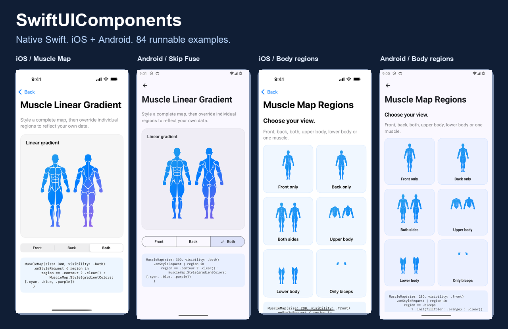

If a component saves you time, [star the repository](https://github.com/shial4/SwiftUIComponents) to help other developers find it.

## Why use it?

- **Adaptive layout.** Cells can have different sizes and respond to changing content.
- **Caller-owned state.** Bind selections, ratings, queries and scroll requests to your screen.
- **Customizable views.** Supply calendar cells and headers, style muscle regions, or use any Shape for progress.
- **Scalable vectors.** Fill, outline or add gradients to shapes and 24 named muscle regions.

## Requirements

Swift 6.3 or later.

| Platform | Minimum version |
| --- | --- |
| iOS / Mac Catalyst | 18 |
| macOS | 15 |
| tvOS | 18 |
| watchOS | 11 |
| Android | API 28 |

## Install

In Xcode, choose **File > Add Package Dependencies**, enter `https://github.com/shial4/SwiftUIComponents.git`, choose **Up to Next Major Version** starting at **1.0.1**, and add the **SwiftUIComponents** library to your target.

Or add the package to `Package.swift`:

```swift
.package(url: "https://github.com/shial4/SwiftUIComponents.git", from: "1.0.1")
```

Then add its product to your target's dependencies:

```swift
.product(name: "SwiftUIComponents", package: "SwiftUIComponents")
```

## Start here

```swift
import SwiftUI
import SwiftUIComponents

struct CalendarScreen: View {
    @State var date = Date()
    @State var selection: TimeRange?

    var body: some View {
        CalendarView(date: $date, selection: $selection, calendar: .current)
    }
}
```

## Component catalogue

Explore 84 playgrounds in the [example app](#run-the-examples). Screenshots and interaction GIFs show iOS on the left and Android on the right. Each section includes a starting snippet and links to the complete example.

| Component | Explore | Source |
| --- | --- | --- |
| [Muscle Map](#muscle-map) | Regions, styles, taps and drag painting | [Example](Examples/Examples/ViewExamples/MuscleMapExampleView.swift) |
| [Calendar](#calendar) | Week, month and year; selection and custom cells | [Example](Examples/Examples/ViewExamples/CalendarExampleView.swift) |
| [DynamicList](#dynamiclist) | Automatic sizing and native scrolling on either axis | [Example](Examples/Examples/ViewExamples/DynamicListExampleView.swift) |
| [Checkbox](#checkbox) | Filled, outlined, labeled and disabled states | [Example](Examples/Examples/ViewExamples/CheckboxExampleView.swift) |
| [RatingView](#ratingview) | Fractional display and star selection | [Example](Examples/Examples/ViewExamples/RatingExampleView.swift) |
| [Badge](#badge) | Counts, text, colors and placement | [Example](Examples/Examples/ViewExamples/BadgeExampleView.swift) |
| [CountingLabel](#countinglabel) | Animated numbers and decimal formats | [Example](Examples/Examples/ViewExamples/LabelExampleView.swift) |
| [Progress](#progress) | Shape, stroke, color and animation | [Example](Examples/Examples/ViewExamples/ProgressExampleView.swift) |
| [JoystickView](#joystickview) | Drag translation and return to center | [Example](Examples/Examples/ViewExamples/InteractionExampleViews.swift) |
| [SearchBar](#searchbar) | Query bindings and focus dismissal | [Example](Examples/Examples/ViewExamples/InteractionExampleViews.swift) |
| [Shapes](#every-general-purpose-shape) | Fills, strokes, gradients, borders and transforms | [Examples](Examples/Examples/ViewExamples/ShapesExampleView.swift) |
| [Modifiers](#every-modifier-and-layout-helper) | Masks, corners, geometry, transitions and layout | [Examples](Examples/Examples/ViewExamples/ModifiersExampleView.swift) |
| [Codable storage](#codable-storage) | JSON persistence and synchronized bindings | [Example](Examples/Examples/ViewExamples/InteractionExampleViews.swift) |
| [Integrations](#integrations-and-non-view-helpers) | Bindings, dates, JSON access and custom vectors | [Examples](Examples/Examples/ViewExamples/UtilityExampleViews.swift) |

### Muscle Map

A workout builder, recovery dashboard or anatomy picker can share the same vectors and typed region identities. Choose which side to show, style each region from your own data, and connect selection to your own state.

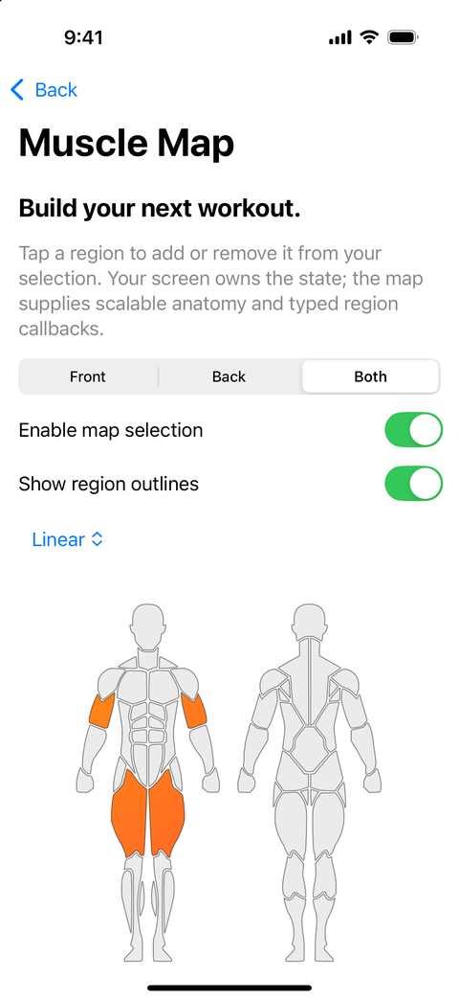 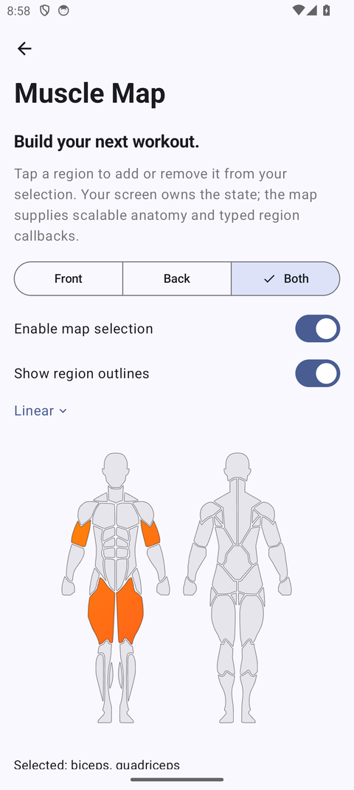

```swift
struct MuscleScreen: View {
    @State var selected: Set<MuscleMap.Structure> = [.biceps, .quadriceps]

    var body: some View {
        MuscleMap(size: 320, visibility: .both, userInteractionEnabled: true)
            .onStyleRequest { region in
                if region == .contour { return .clear() }
                return MuscleMap.Style(
                    fillColor: .gray.opacity(0.18),
                    gradientColors: selected.contains(region) ? [.orange, .red] : [],
                    strokeColor: .primary.opacity(0.5), lineWidth: 0.75
                )
            }
            .onStructureSelect { region in
                if selected.contains(region) {
                    selected.remove(region)
                } else {
                    selected.insert(region)
                }
            }
    }
}
```

#### Fill, stroke, gradients and borders

Open **Muscle Map Styles** for the gallery, or any individual style for its own playground. [Shared source](Examples/Examples/ViewExamples/MuscleMapShowcaseViews.swift).

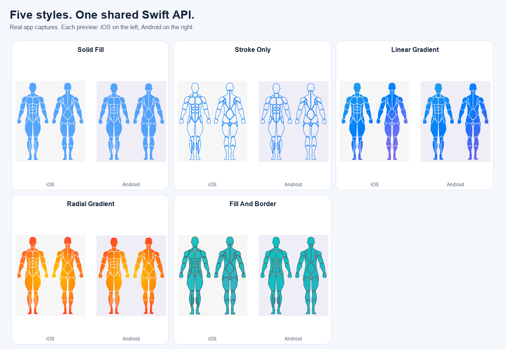

Choose a style, then return it from `.onStyleRequest`:

<details>
<summary>Code for all five styles</summary>

```swift
let solidFill = MuscleMap.Style(fillColor: .blue.opacity(0.65))

let outline = MuscleMap.Style(
    fillColor: .clear,
    strokeColor: .blue,
    lineWidth: 1.25
)

let linearGradient = MuscleMap.Style(gradientColors: [.cyan, .blue, .purple])

let radialGradient = MuscleMap.Style(
    gradientColors: [.yellow, .orange, .red],
    gradientKind: .radial,
    gradientRadius: 150
)

let borderedFill = MuscleMap.Style(
    gradientColors: [.mint, .teal],
    strokeColor: .primary.opacity(0.7),
    lineWidth: 1
)

MuscleMap(size: 300, visibility: .both)
    .onStyleRequest { region in
        region == .contour ? .clear() : linearGradient
    }
```

</details>

A gradient takes precedence when `gradientColors` contains at least two colors. Fill and stroke are independent: use `.clear` fill for an outline, `.clear` stroke for a fill, or both for a bordered gradient. Return nil to use the default style. Return `.clear()` to hide a region; hiding does not disable hit testing.

#### Front, back, both, upper, lower or one muscle

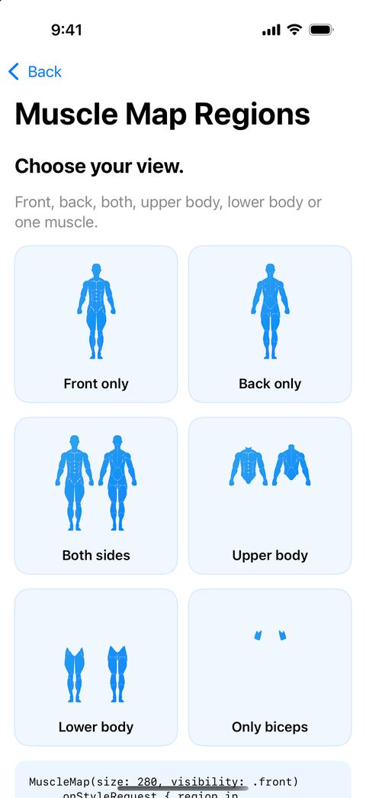 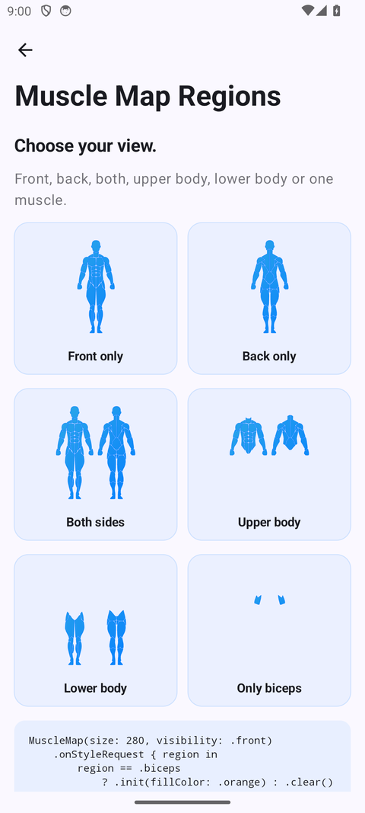

```swift
MuscleMap(size: 280, visibility: .front)
MuscleMap(size: 280, visibility: .back)
MuscleMap(size: 280, visibility: .both)
```

Hide everything except the muscle you need:

```swift
MuscleMap(size: 280, visibility: .front)
    .onStyleRequest { region in
        region == .biceps ? .init(fillColor: .orange) : .clear()
    }
```

Group membership belongs to your app. For example, an upper-body screen can show a set of named structures:

```swift
let upperBody: Set<MuscleMap.Structure> = [
    .neck, .trapezius, .deltoid, .pectoralisMajor, .externalOblique,
    .abdominals, .biceps, .forearms, .hands, .infraspinatus,
    .teresMajor, .triceps, .latissimusDorsi, .lowerBack,
]
let lowerBody: Set<MuscleMap.Structure> = [
    .hips, .quadriceps, .calves, .tibialisAnterior,
    .tibiaAndFoot, .gluteus, .thighs, .hamstrings,
]

MuscleMap(size: 280)
    .onStyleRequest { region in
        upperBody.contains(region)
            ? .init(gradientColors: [.cyan, .blue]) : .clear()
    }
```

Feed your own data into the callback for intensity maps, selected workout regions, progress or status colors. The library does not own those rules:

```swift
let intensity: [MuscleMap.Structure: Double] = [.biceps: 0.8, .quadriceps: 0.5]
MuscleMap(size: 280)
    .onStyleRequest { region in
        region == .contour
            ? .clear()
            : .init(fillColor: .orange.opacity(intensity[region, default: 0.15]))
    }
```

#### Tap and drag integrations

The complete map handles taps when `userInteractionEnabled` is true. `.onStructureSelect` reports a typed `Structure`; toggle a set, update a detail pane, or pass the value to your own workflow. The main example also exposes every region as a searchable toggle for keyboard access.

For drag painting, own the gesture and reuse the public side-view hit testing. [Paint/erase playground](Examples/Examples/ViewExamples/MuscleMapShowcaseViews.swift).

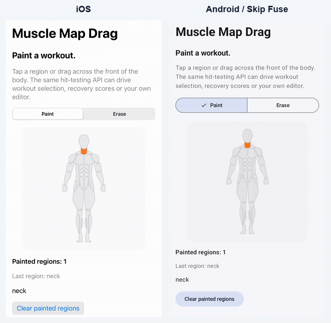

Tap one muscle, paint several with a drag, then erase or clear the selection.

```swift
struct DragMuscleScreen: View {
    @State var selected: Set<MuscleMap.Structure> = []

    var body: some View {
        GeometryReader { proxy in
            let size = min(proxy.size.width, 320)
            let front = MuscleMap.Front(translationX: 5)
                .onStructureSelect { selected.insert($0) }
                .onStyleRequest { region in
                    if region == .contour { return .clear() }
                    return .init(
                        fillColor: selected.contains(region)
                            ? .orange : .gray.opacity(0.15))
                }
            front.frame(width: size, height: size)
                .gesture(
                    DragGesture(minimumDistance: 0)
                        .onChanged { value in
                            front.handleTap(
                                location: value.location,
                                in: CGRect(x: 0, y: 0, width: size, height: size))
                        })
        }.frame(height: 320)
    }
}
```

The standalone **MuscleMap.Front** and **MuscleMap.Back** examples demonstrate direct composition and caller-owned tapping. Use `translationX: 5` to center the front, or `translationX: -5.2` to center the back. Both expose `handleTap(location:in:)`, `.onStyleRequest` and `.onStructureSelect`.

On Apple platforms, the complete map exposes named VoiceOver selection actions. tvOS uses a region menu because location-based tapping is unavailable. The shared region toggle list provides another way to select regions on Android.

#### Every anatomical shape, on its own

All 32 front/back vectors have dedicated previews with fill, stroke, gradient and border controls. [Atlas and isolated-preview source](Examples/Examples/ViewExamples/MuscleShapeExamples.swift).

<details>
<summary>Front: all 16 anatomical shapes</summary>

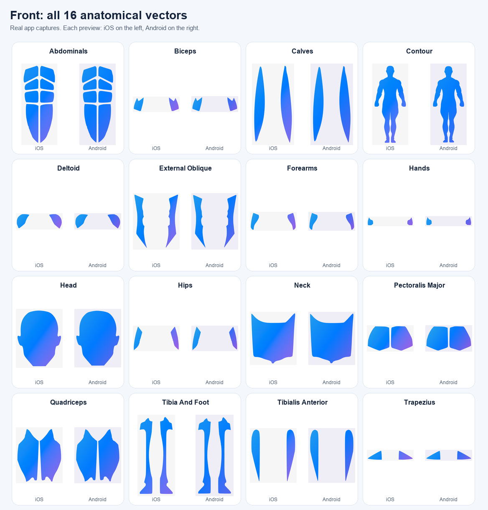

| Individual preview | Public shape |
| --- | --- |
| Front Abdominals | `MuscleMap.Front.Abdominals()` |
| Front Biceps | `MuscleMap.Front.Biceps()` |
| Front Calves | `MuscleMap.Front.Calves()` |
| Front Contour | `MuscleMap.Front.Contour()` |
| Front Deltoid | `MuscleMap.Front.Deltoid()` |
| Front External Oblique | `MuscleMap.Front.ExternalOblique()` |
| Front Forearms | `MuscleMap.Front.Forearms()` |
| Front Hands | `MuscleMap.Front.Hands()` |
| Front Head | `MuscleMap.Front.Head()` |
| Front Hips | `MuscleMap.Front.Hips()` |
| Front Neck | `MuscleMap.Front.Neck()` |
| Front Pectoralis Major | `MuscleMap.Front.PectoralisMajor()` |
| Front Quadriceps | `MuscleMap.Front.Quadriceps()` |
| Front Tibia And Foot | `MuscleMap.Front.TibiaAndFoot()` |
| Front Tibialis Anterior | `MuscleMap.Front.TibialisAnterior()` |
| Front Trapezius | `MuscleMap.Front.Trapezius()` |

</details>

<details>
<summary>Back: all 16 anatomical shapes</summary>

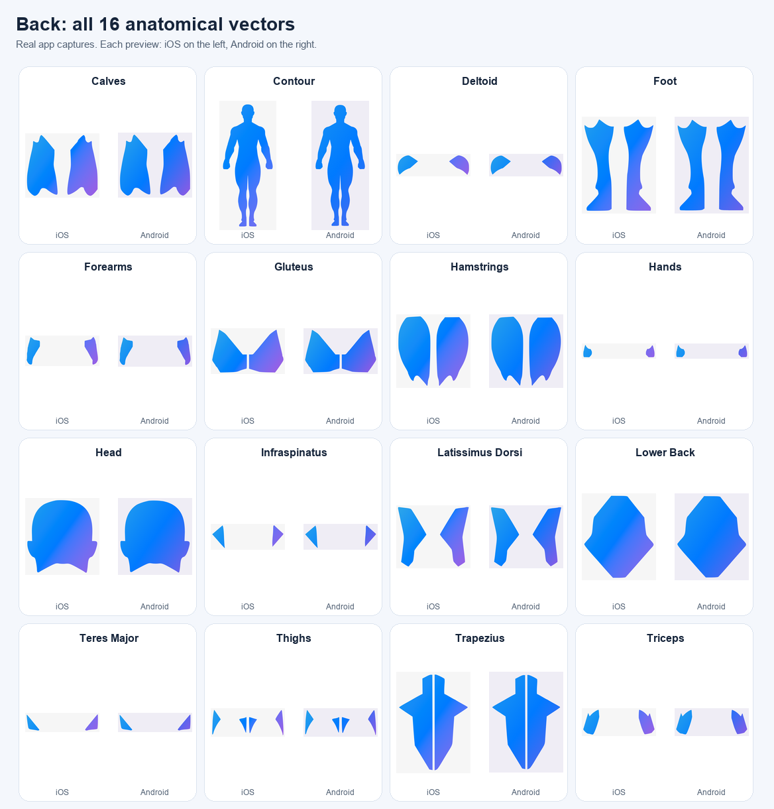

| Individual preview | Public shape |
| --- | --- |
| Back Calves | `MuscleMap.Back.Calves()` |
| Back Contour | `MuscleMap.Back.Contour()` |
| Back Deltoid | `MuscleMap.Back.Deltoid()` |
| Back Foot | `MuscleMap.Back.Foot()` |
| Back Forearms | `MuscleMap.Back.Forearms()` |
| Back Gluteus | `MuscleMap.Back.Gluteus()` |
| Back Hamstrings | `MuscleMap.Back.Hamstrings()` |
| Back Hands | `MuscleMap.Back.Hands()` |
| Back Head | `MuscleMap.Back.Head()` |
| Back Infraspinatus | `MuscleMap.Back.Infraspinatus()` |
| Back Latissimus Dorsi | `MuscleMap.Back.LatissimusDorsi()` |
| Back Lower Back | `MuscleMap.Back.LowerBack()` |
| Back Teres Major | `MuscleMap.Back.TeresMajor()` |
| Back Thighs | `MuscleMap.Back.Thighs()` |
| Back Trapezius | `MuscleMap.Back.Trapezius()` |
| Back Triceps | `MuscleMap.Back.Triceps()` |

</details>

Use any individual vector with ordinary SwiftUI or the combined fill-and-border helpers:

```swift
MuscleMap.Front.Biceps(translationX: 5)
    .fill(.orange, strokeBorder: .red, lineWidth: 1)
MuscleMap.Back.LatissimusDorsi(translationX: -5.2)
    .fill(
        MuscleMap.Style(
            gradientColors: [.cyan, .blue],
            strokeColor: .primary, lineWidth: 1))
```

Individual vectors share the complete map's coordinate system. For a large isolated icon, the example's `FittedMuscleShape` measures and fits the path bounds; when composing an anatomical map, keep the original coordinates. `MuscleMapShape` also exposes `path(in:)`, `path(width:height:)` and `contains(point:in:)`. Named identities round-trip with `Structure.create(displayName:)` and match with `has(target:)`.

The **Custom Muscle Vector** example adopts `MuscleMapShape` and builds a path with `MuscleMapVectorPath.Builder.move`, `addLine`, `addCurve` and `closeSubpath`. [Complete custom-vector source](Examples/Examples/ViewExamples/UtilityExampleViews.swift).

### Calendar

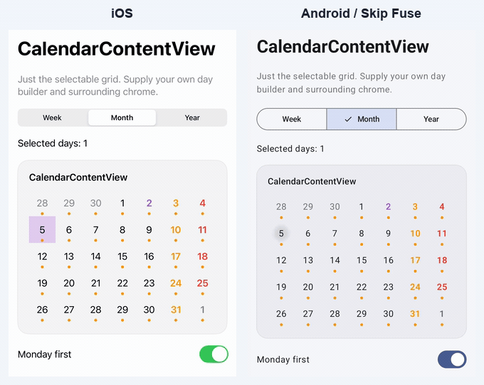

The grid playground shows tap selection, drag extension and switching between month and week.

Use `.weekly`, `.monthly` or `.yearly(columns)`. Year layouts include every calendar month, including leap months. Column counts are clamped to 1...12. Date generation respects the supplied calendar, time zone and first weekday, including daylight-saving transitions.

```swift
CalendarView(
    date: $date, selection: $selection, calendar: .current, type: .monthly,
    contentColorIndicator: { date in
        Calendar.current.isDateInWeekend(date) ? .orange : nil
    }
)
.multiselectionEnabled(true)
.selectionEnabled(true)
.dayView { date, calendar, inMonth, position in
    Text("\(calendar.component(.day, from: date))")
        .foregroundStyle(inMonth ? Color.primary : .secondary)
        .frame(maxWidth: .infinity, maxHeight: .infinity)
        .background(position == nil ? .clear : Color.blue.opacity(0.2))
}
```

Custom builders retain the period, calendar and selection options. Use `.headerView`, `.weekdaysView` and `.dayView`, or the public generic initializer for fully custom content. Provide a `CalendarColorSet` to customize default colors. `DefaultCalendarView` wraps the default builders; `CalendarContentView` displays only the grid. The default header, day and weekday views are also usable separately.

A tap starts a selection; a second distinct tap extends a single-day selection into a range. Tapping a selected day or an existing multi-day range clears it. With multiselection disabled, tapping another day replaces the selection. Dragging grows a range. `TimeRange.toArray(calendar:)` returns inclusive calendar days; reversed ranges are empty.

#### Standalone calendar building blocks

Each public calendar view has its own playground. [Shared example source](Examples/Examples/ViewExamples/CalendarPartsExampleView.swift).

<details>
<summary>DefaultCalendarView: The complete default-built calendar.</summary>

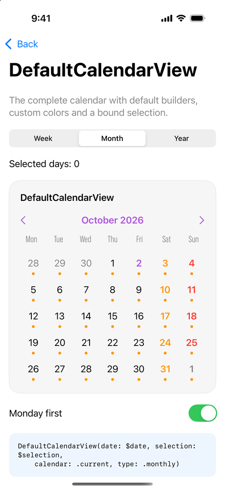 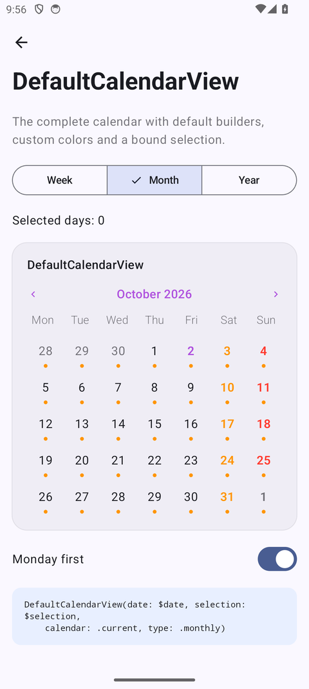

```swift
DefaultCalendarView(
    date: $date, selection: $selection,
    calendar: .current, type: .monthly)
```

</details>

<details>
<summary>CalendarContentView: Only the grid, with your own day builder.</summary>

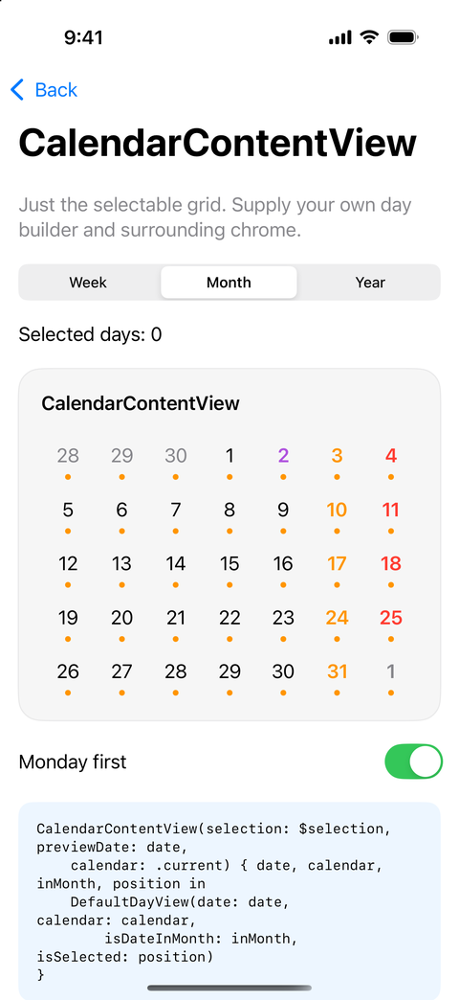 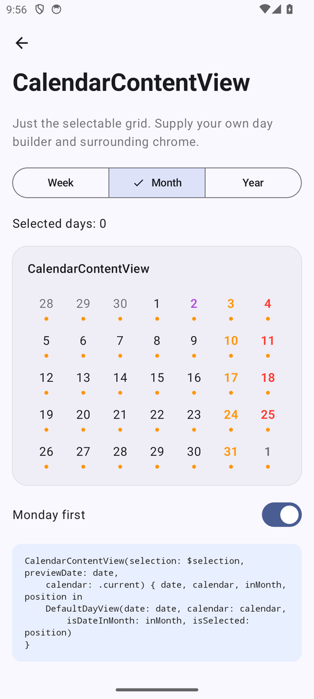

```swift
CalendarContentView(
    selection: $selection, previewDate: date,
    calendar: .current
) { date, calendar, inMonth, position in
    DefaultDayView(
        date: date, calendar: calendar,
        isDateInMonth: inMonth, isSelected: position)
}
```

</details>

<details>
<summary>DefaultDayView: Selection states and an optional event dot.</summary>

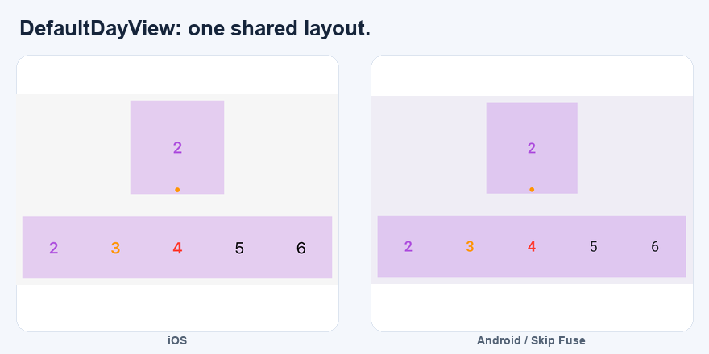

```swift
DefaultDayView(
    date: date, calendar: .current, isDateInMonth: true,
    isSelected: .single, contentColor: .orange, size: 100)
```

Pass `size` when the parent knows the cell dimensions. Inside `CalendarContentView`, each day inherits the size calculated by the grid.

</details>

<details>
<summary>DefaultCalendarHeaderView: Bound period navigation and a return-to-today action.</summary>

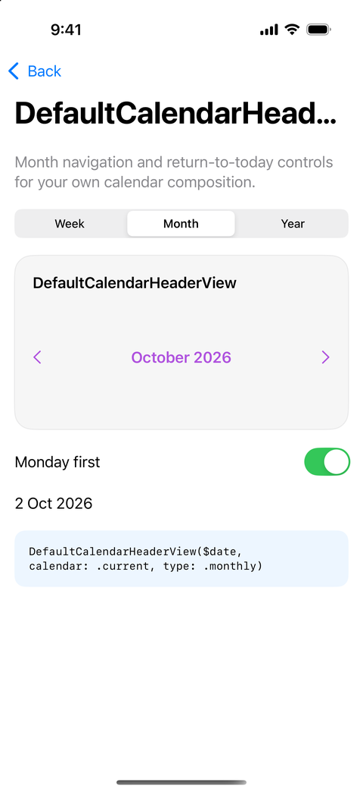 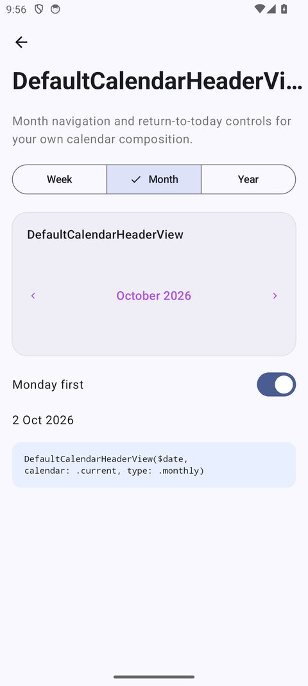

```swift
DefaultCalendarHeaderView($date, calendar: .current, type: .monthly)
```

</details>

<details>
<summary>DefaultWeekdaysHeaderView: Localized names ordered by the supplied calendar.</summary>

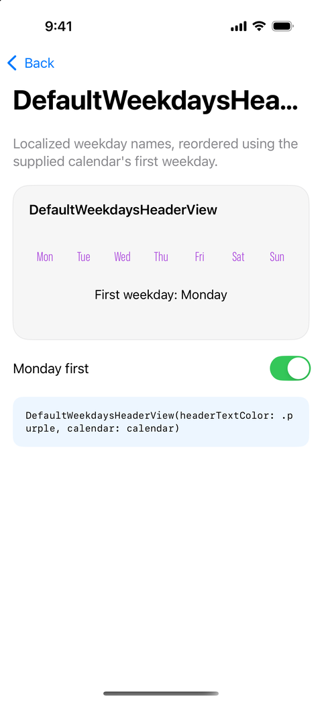 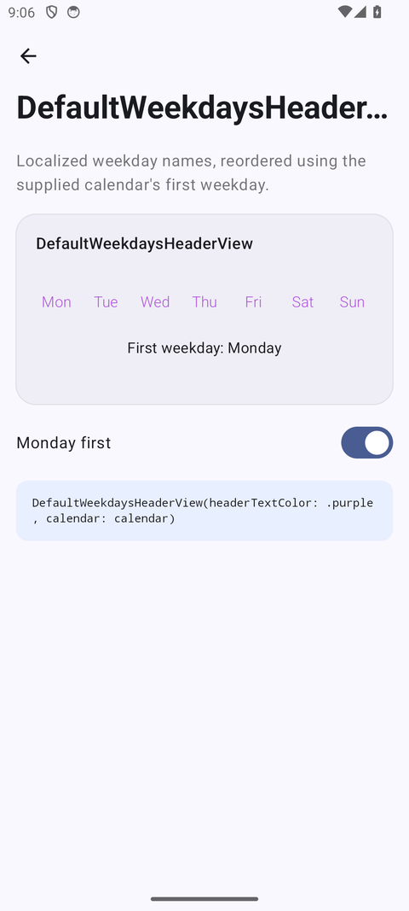

```swift
DefaultWeekdaysHeaderView(headerTextColor: .purple, calendar: calendar)
```

</details>

Implement `CalendarColorSet` to supply your own today, weekend, weekday, selection, out-of-month, header and button colors. `DefaultCalendarColorSet()` provides the defaults; the example's `DemoCalendarColors` shows a complete custom palette.

### DynamicList

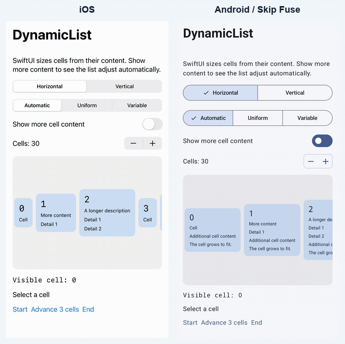

Add content and watch cells resize automatically. Scroll by index or drag, then switch axes.

```swift
struct ListScreen: View {
    @State var scrollToIndex: Int?
    @State var visibleIndex: Int?

    var body: some View {
        VStack {
            DynamicList(
                scrollToIndex: $scrollToIndex, orientation: .horizontal,
                numberOfItems: 100
            ) { index in
                Text("Cell \(index)").padding()
            }
            .onVisibleCellChange { visibleIndex = $0 }
            .frame(height: 80)
            Button("Advance") {
                withAnimation { scrollToIndex = min(99, (visibleIndex ?? 0) + 3) }
            }
        }
    }
}
```

Omit cell lengths to let SwiftUI lay out each cell from its content. Cells can have different lengths and resize as text, images, Dynamic Type or other content changes. SwiftUI's lazy stacks estimate the extent of cells that have not appeared yet and refine it during scrolling.

For variable-height rows, use the same automatic initializer:

```swift
DynamicList(orientation: .vertical, numberOfItems: messages.count) { index in
    Text(messages[index])
        .frame(maxWidth: .infinity, alignment: .leading)
        .padding()
}
```

Each row wraps to the available width and determines its own height. Changing its content updates the layout automatically. Give the list a bounded viewport through a frame or parent layout.

- **Automatic sizing:** omit lengths, as above.
- **Uniform sizing:** add `itemLength: 80`.
- **Variable sizing:** replace `numberOfItems` with `itemLengths: [60, 100, 80]`.
- **Programmatic scrolling:** set `scrollToIndex`. Requests are clamped to valid indices and reset to nil after processing.
- **Scroll observation:** use `.onVisibleCellChange`; empty content reports nil.

Cells use index identity. For data that can be reordered, use native `ForEach(items)` with stable model IDs. On Android, place the list in a non-scrolling parent such as `VStack`; nesting scroll containers on the same axis is unsupported.

The `scrollOffset: Binding<Double>` overloads are Apple-only, with zero at the leading edge and negative values toward the trailing edge. Use `scrollToIndex` for shared code.

### Checkbox

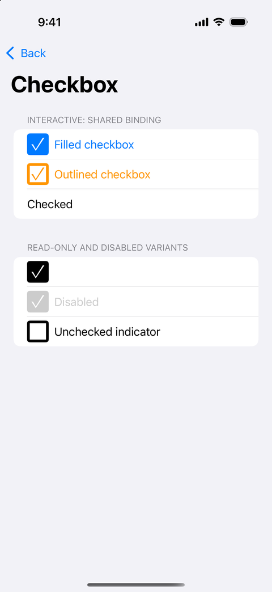 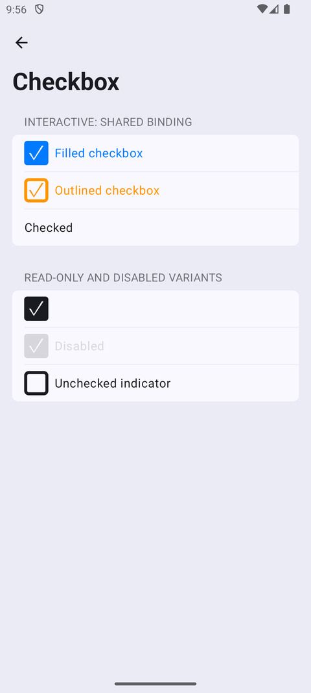

```swift
Checkbox(label: "Notifications", checked: $enabled).stroked()
```

Choose filled or outlined styling. Binding initializers are interactive; Bool initializers display read-only indicators. Add a label, colors, a frame or `.disabled(true)` using standard modifiers.

### RatingView

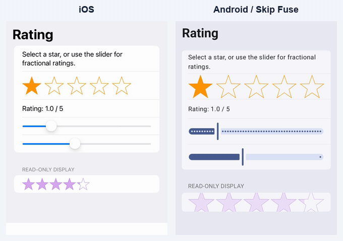

Tap a star for a whole rating; drag the slider to see fractional fills.

```swift
RatingView(rating: $rating, spacing: 8)
    .foregroundStyle(.orange)
    .frame(height: 48)
```

Display fractional stars or let the user select a whole-star rating. The five square cells fit the available width and height. Set spacing, size and foreground style with ordinary SwiftUI modifiers.

### Badge

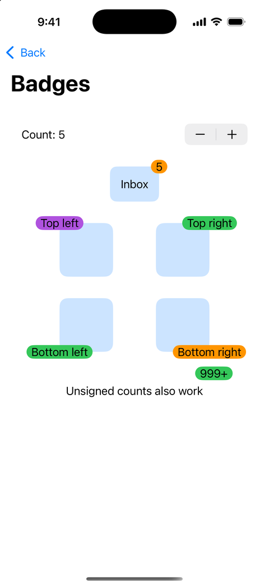 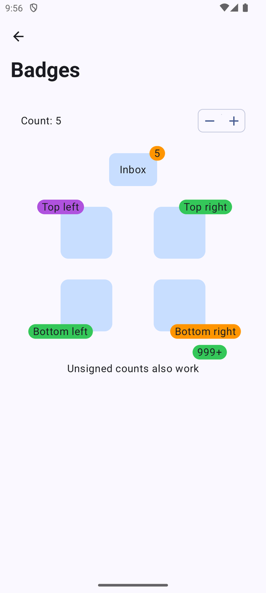

```swift
Text("Inbox").badge(count: 120, max: 99, color: .orange)
Text("Updates").badge(label: "NEW", color: .blue, alignment: .topLeading)
```

Counts above the maximum display a compact label such as `99+`. Use custom text and color, or attach a badge to any of the four corners without changing the base view's layout.

### CountingLabel

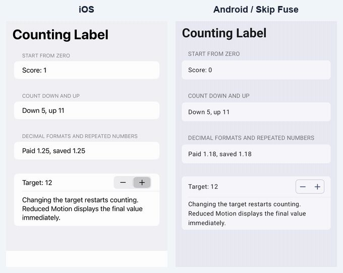

```swift
CountingLabel(from: "Paid 0.00", to: "Paid 12.50", interval: 0.02, format: ["%0.2f"])
CountingLabel(from: "Down 100, up 0", to: "Down 50, up 50", interval: 0.02)
CountingLabel(to: "Complete: 50.0%", interval: 0.01, format: ["%0.1f"])
```

The playground's target control replays every format together. Pass changing `to` values to animate new targets; each label restarts from its `from` value, or zero when omitted.

CountingLabel matches signed ASCII decimal numbers, pairs them by position and finishes in at most 120 frames. Mismatched number counts display the target immediately. Short format arrays use defaults. It accepts bounded floating-point printf formats (`f`, `e`, `g` and uppercase variants); unsafe formats fall back to `%0.0f`. Tasks cancel on disappearance and restart when inputs change.

### Progress

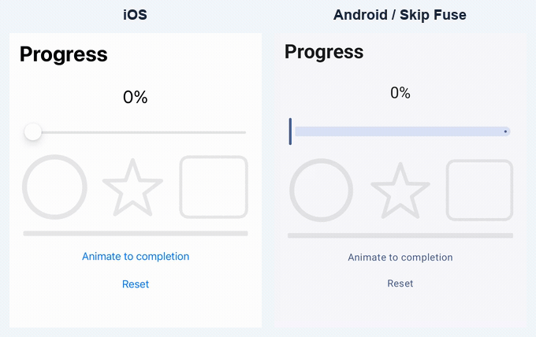

```swift
SwiftUIComponents.Progress(progress: $progress, content: Circle(), lineWidth: 8)
    .foregroundStyle(.orange)
    .backgroundStyle(.gray.opacity(0.2))
    .frame(width: 100, height: 100)
```

Use any Shape, including the supplied Star and Triangle. Choose a line width or a full StrokeStyle with caps, joins and dashes. Values are clamped to 0...1.

### JoystickView

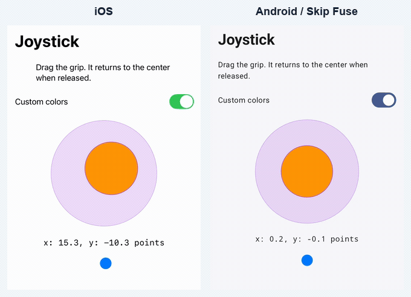

Drag in any direction. The bound coordinates update during the gesture and reset on release.

```swift
JoystickView(translation: $translation)
    .accentColor(.purple).gripColor(.orange)
    .frame(width: 180, height: 180)
```

Reports raw drag distance in points and returns to zero on release. The visible grip stays inside the control. tvOS supports directional remote commands and Exit to reset.

### SearchBar

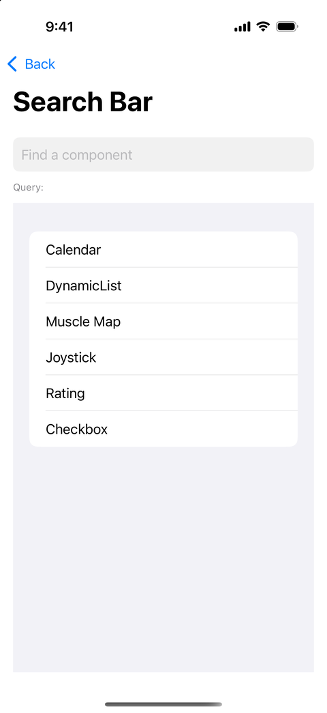 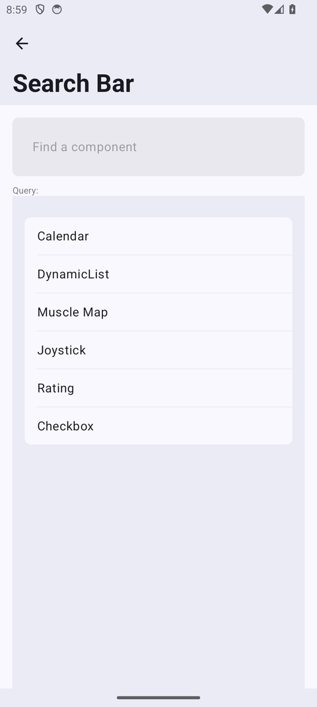

```swift
SearchBar(text: $query, prompt: "Find a component")
```

Bind the query to your own filtering logic. The inline field includes a clear-and-dismiss action while focused.

### Every general-purpose shape

Fill it, outline it, add a gradient or combine a fill with a border. Every shape has its own playground with relevant controls, including star points, thickness, triangle direction, corner radius, dashed outlines and rotation. [Complete shape examples](Examples/Examples/ViewExamples/ShapesExampleView.swift).

<details>
<summary>Arrow</summary>

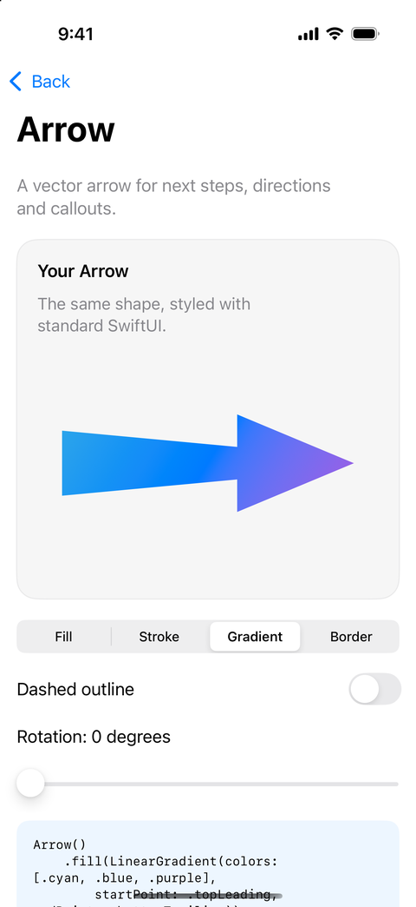 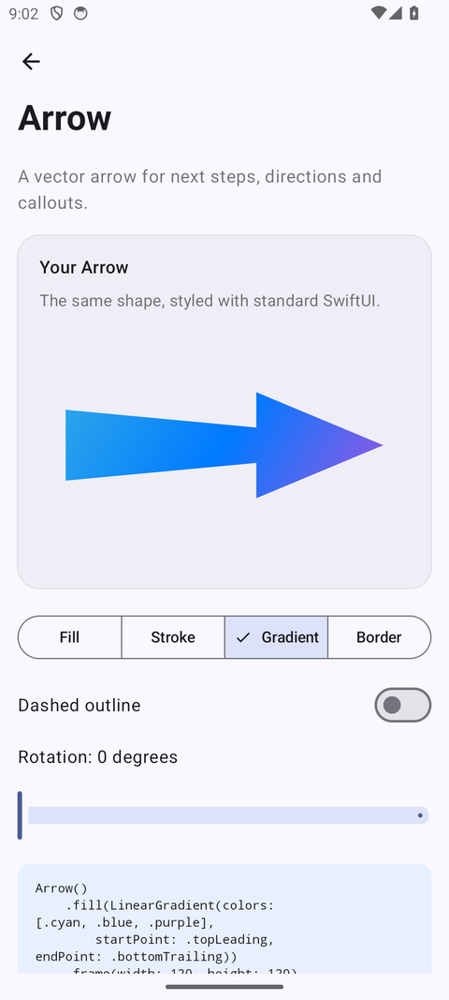

```swift
Arrow()
    .fill(
        LinearGradient(
            colors: [.cyan, .blue, .purple],
            startPoint: .topLeading, endPoint: .bottomTrailing)
    )
    .frame(width: 120, height: 120)
```

</details>

<details>
<summary>Chevron</summary>

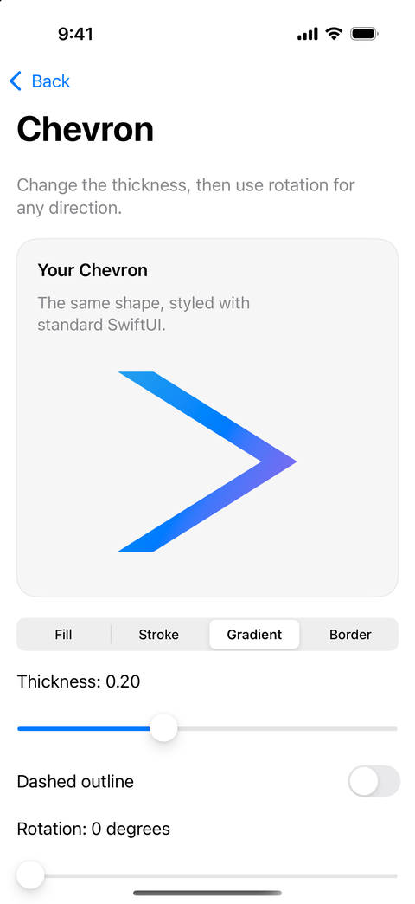 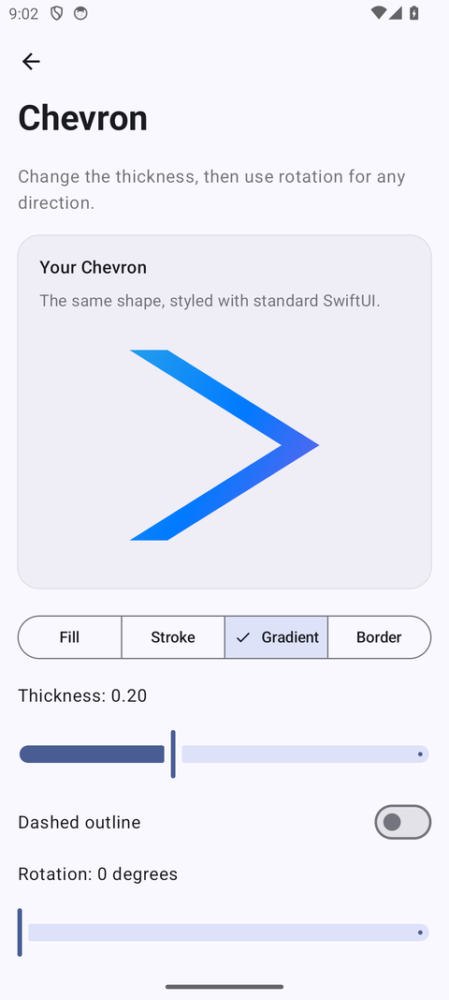

```swift
Chevron(thickness: 0.2)
    .fill(
        LinearGradient(
            colors: [.cyan, .blue, .purple],
            startPoint: .topLeading, endPoint: .bottomTrailing)
    )
    .frame(width: 120, height: 120)
```

</details>

<details>
<summary>Star</summary>

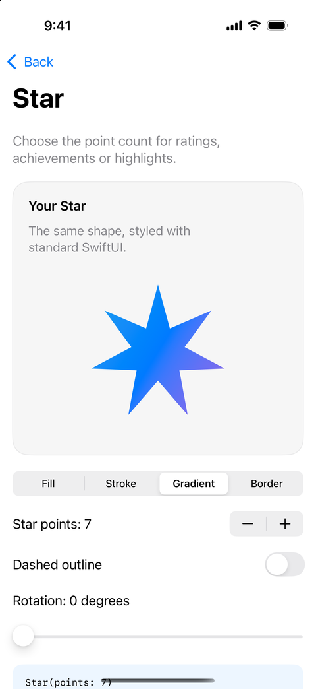 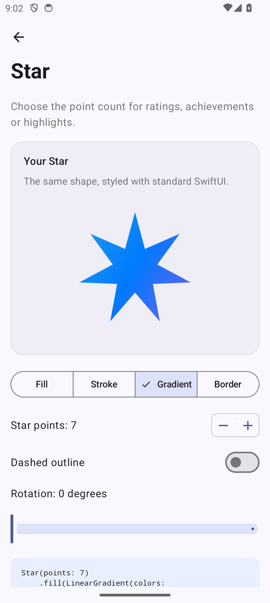

```swift
Star(points: 7)
    .fill(
        LinearGradient(
            colors: [.cyan, .blue, .purple],
            startPoint: .topLeading, endPoint: .bottomTrailing)
    )
    .frame(width: 120, height: 120)
```

</details>

<details>
<summary>Tick</summary>

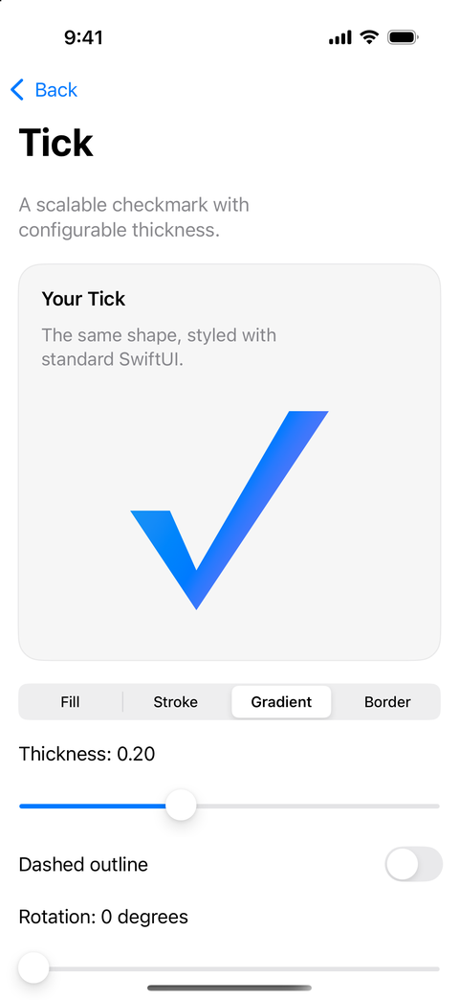 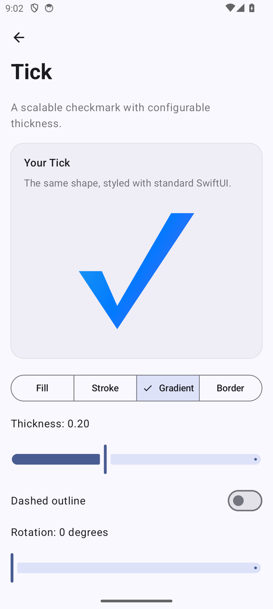

```swift
Tick(thickness: 0.2)
    .fill(
        LinearGradient(
            colors: [.cyan, .blue, .purple],
            startPoint: .topLeading, endPoint: .bottomTrailing)
    )
    .frame(width: 120, height: 120)
```

</details>

<details>
<summary>Triangle</summary>

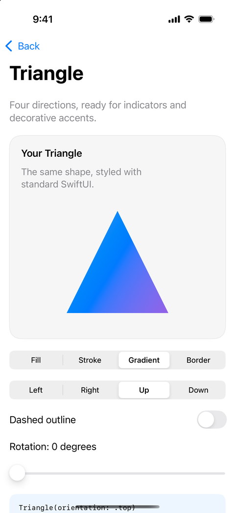 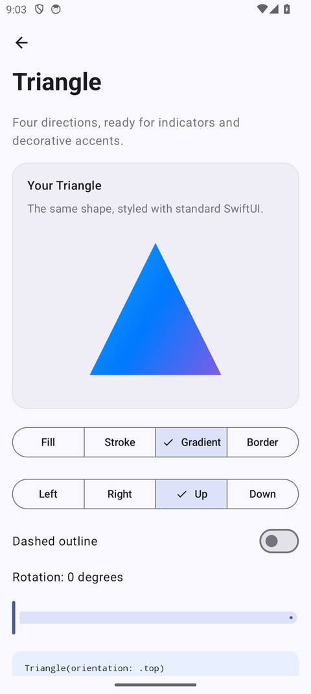

```swift
Triangle(orientation: .top)
    .fill(
        LinearGradient(
            colors: [.cyan, .blue, .purple],
            startPoint: .topLeading, endPoint: .bottomTrailing)
    )
    .frame(width: 120, height: 120)
```

</details>

<details>
<summary>XMark</summary>

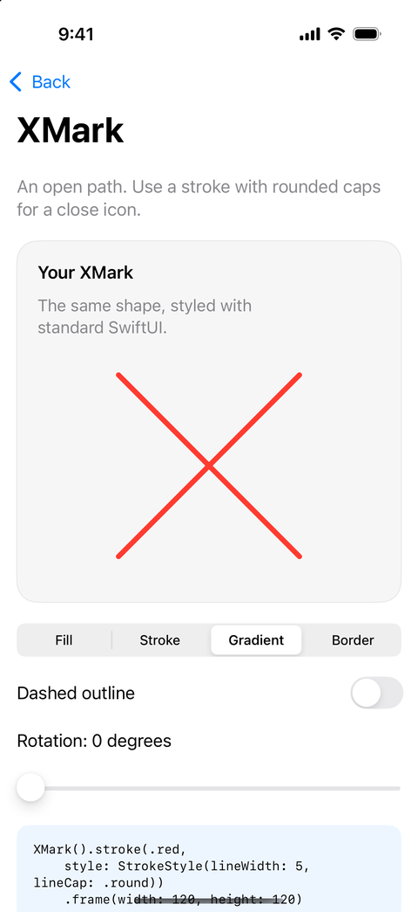 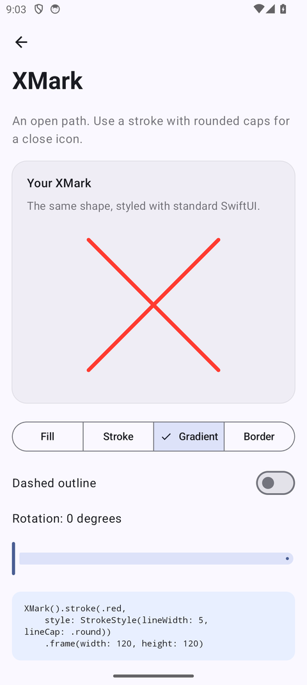

```swift
XMark()
    .stroke(.red, style: StrokeStyle(lineWidth: 5, lineCap: .round))
    .frame(width: 120, height: 120)
```

</details>

<details>
<summary>Plus</summary>

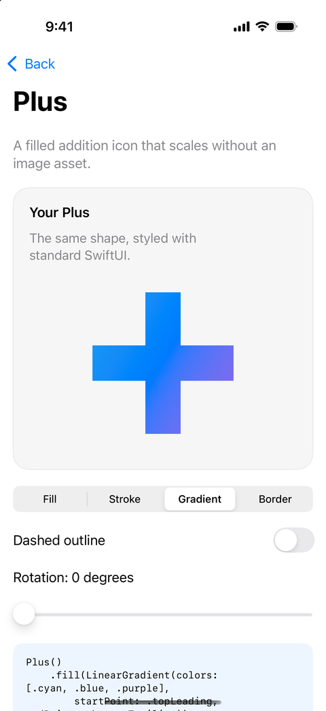 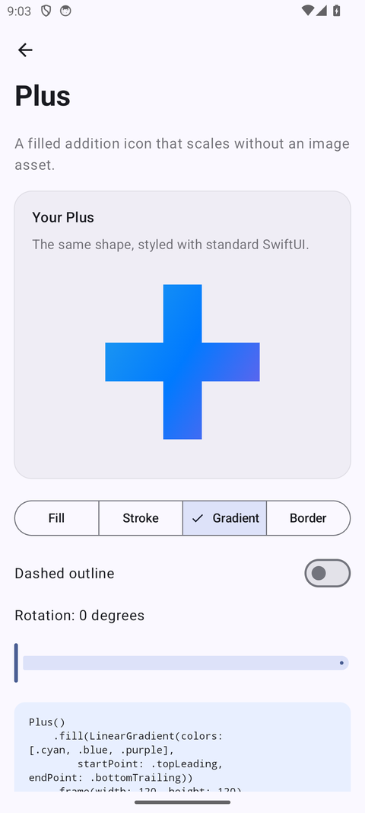

```swift
Plus()
    .fill(
        LinearGradient(
            colors: [.cyan, .blue, .purple],
            startPoint: .topLeading, endPoint: .bottomTrailing)
    )
    .frame(width: 120, height: 120)
```

</details>

<details>
<summary>Minus</summary>

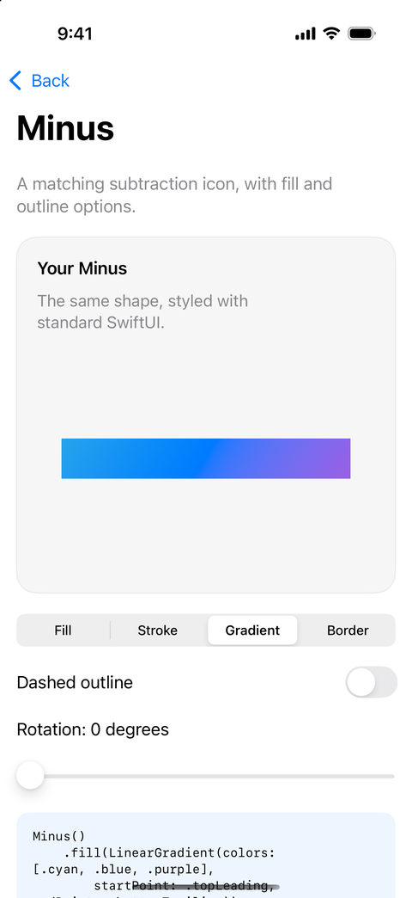 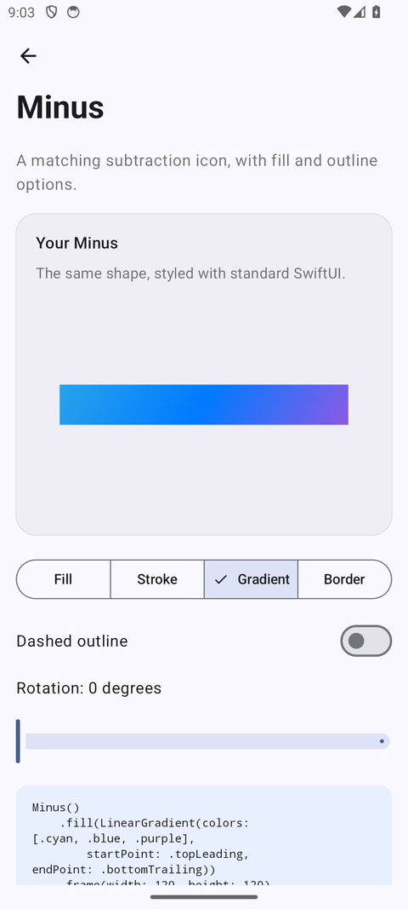

```swift
Minus()
    .fill(
        LinearGradient(
            colors: [.cyan, .blue, .purple],
            startPoint: .topLeading, endPoint: .bottomTrailing)
    )
    .frame(width: 120, height: 120)
```

</details>

<details>
<summary>RoundedCorner</summary>

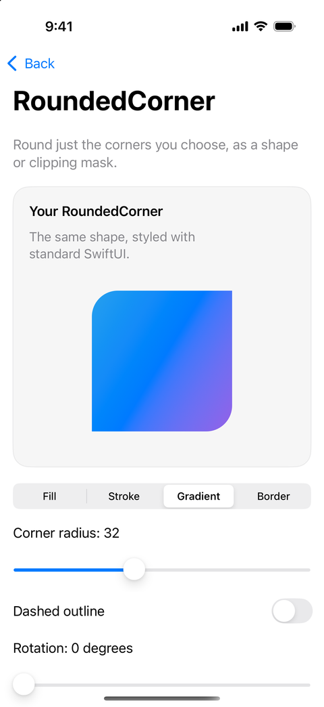 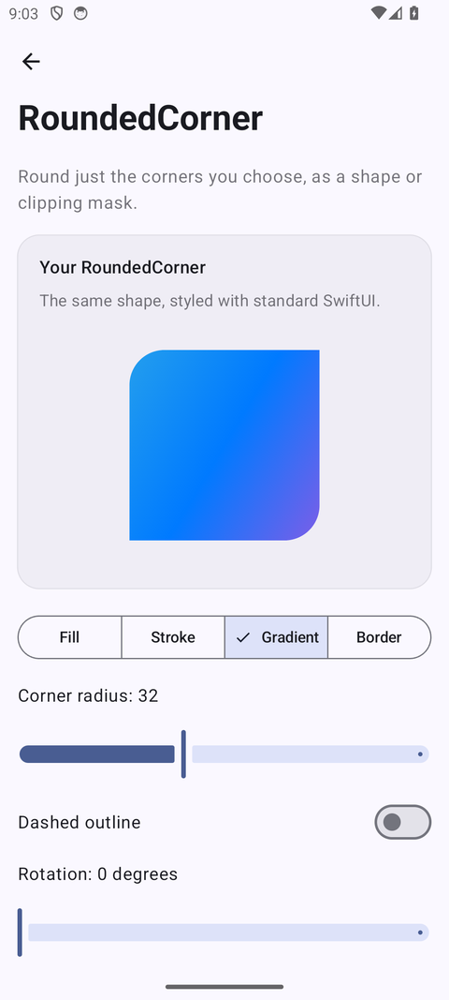

```swift
RoundedCorner(radius: 32, corners: [.topLeft, .bottomRight])
    .fill(
        LinearGradient(
            colors: [.cyan, .blue, .purple],
            startPoint: .topLeading, endPoint: .bottomTrailing)
    )
    .frame(width: 120, height: 120)
```

</details>

Shapes support transforms and nonzero drawing origins. Star accepts 2...1024 points; other counts produce an empty path. Chevron and Tick expose thickness. Triangle exposes four directions. XMark is an open path, so its playground always strokes it. RoundedCorner is a shape as well as the basis for selected-corner clipping.

### Every modifier and layout helper

Each helper has its own screen and a visible result. [Complete modifier playgrounds](Examples/Examples/ViewExamples/ModifiersExampleView.swift).

<details>
<summary>Reverse Mask</summary>

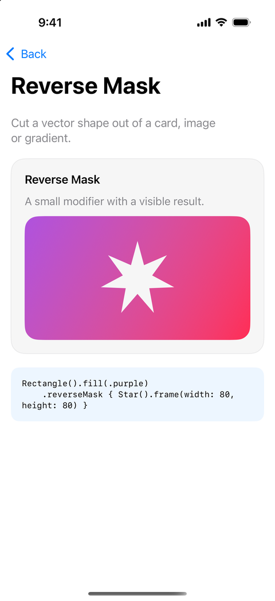 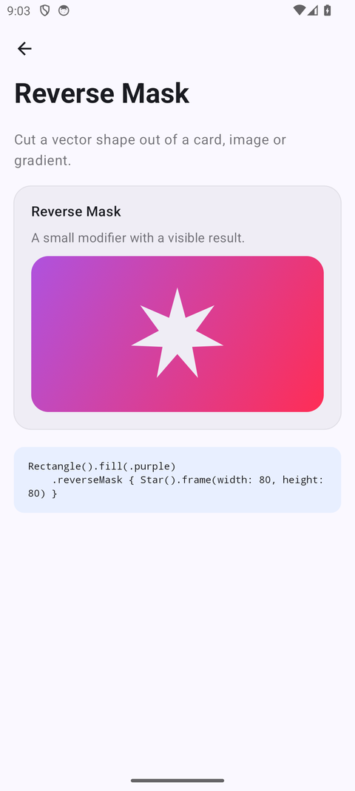

```swift
Rectangle().fill(.purple)
    .reverseMask { Star().frame(width: 80, height: 80) }
    .frame(width: 180, height: 120)
```

</details>

<details>
<summary>Corner Radius</summary>

 

```swift
Text("Hello").padding(24).background(.blue.opacity(0.2))
    .cornerRadius(24, corners: .topLeft, .bottomRight)
```

</details>

<details>
<summary>Size Observation</summary>

 

```swift
Text(title).padding().size(onChange: $measuredSize)
// Callback overload:
Text(title).size { size in print(size) }
```

</details>

<details>
<summary>Frame Observation</summary>

 

```swift
Text(title).padding().frame(onChange: $measuredFrame)
// Callback overload; coordinates are global:
Text(title).frame { frame in print(frame) }
```

</details>

<details>
<summary>Conditional Modifier</summary>

 

```swift
Text("Featured")
    .if(featured) { $0.bold().foregroundStyle(.orange) }
```

</details>

<details>
<summary>Composed Modifier</summary>

 

```swift
Text("One builder").modified {
    $0.padding().background(.blue.opacity(0.2))
}
```

</details>

<details>
<summary>FrameModifier</summary>

 

```swift
Text("Move me").modifier(
    FrameModifier(
        offset: CGSize(width: 8, height: 0), rotation: .degrees(8),
        scale: CGSize(width: 1.1, height: 1.1), anchor: .center))
```

</details>

<details>
<summary>Transform Transition</summary>

 

```swift
if show {
    Text("Hello again")
        .transition(
            .transform(
                from: CGRect(x: 0, y: 0, width: 10, height: 10),
                to: CGRect(x: 0, y: 0, width: 180, height: 44),
                rotation: .degrees(45)))
}
Button("Toggle") { withAnimation { show.toggle() } }
```

</details>

<details>
<summary>StackView</summary>

 

```swift
StackView(orientation: vertical ? .vertical : .horizontal) {
    Text("One")
    Text("Two")
}
```

</details>

Geometry modifiers report size or global frame changes. For platform-specific transition and axis-switching behavior, see the [compatibility notes](Android/README.md#platform-behavior).

### Codable storage

 

```swift
struct Preferences: Codable {
    var favorite = "Calendar"
}

struct PreferencesScreen: View {
    @CodableAppStorage("preferences") private var preferences = Preferences()

    var body: some View {
        TextField("Favorite", text: $preferences.favorite)
    }
}
```

Pass `store:` to use a specific `UserDefaults` suite. Missing/corrupt JSON returns the supplied default. Encoding failure preserves stored data. Wrappers sharing a key observe the same underlying data. `UserDefaults.setCodable(_:forKey:)` and `codable(forKey:)` provide standalone JSON access; passing nil removes the key.

### Integrations and non-view helpers

The catalogue also gives bindings, direct JSON access, calendar-aware date helpers and custom vectors their own screens. [Complete integration examples](Examples/Examples/ViewExamples/UtilityExampleViews.swift).

<details>
<summary>Key-path bindings: one reference owner, live controls</summary>

 

```swift
Toggle("Enabled", isOn: Binding(for: \.enabled, on: settings))
TextField("Title", text: Binding.create(for: \.label, on: settings))
```

The example uses an `@Observable` reference owner. Import `SkipFuse` in a Fuse module to enable its Android observation bridge. Both binding APIs operate on the main actor.

</details>

<details>
<summary>Dates and TimeRange: calendar-aware helpers and inclusive ranges</summary>

 

```swift
let start = date.normalized(calendar)
let range = TimeRange(start: start, end: end)
let days = range.toArray(calendar: calendar)
let span = range.span(calendar: calendar)
let included = range.contains(start)
let sameDay = date.compareDate(otherDate, calendar: calendar)
let february = date.shiftToMonth(2, calendar: calendar)
```

`TimeRange()` starts on today; the explicit initializer preserves your endpoints. `span` measures the requested calendar components, while `toArray` includes both endpoint days. Reversed ranges produce an empty array. Native `ClosedRange<Date>` also exposes `span` and `toArray`. Date helpers include `firstWeekday`, `weekday`, `day`, `month`, `year`, `timeString`, `dateString`, and current-week/month/year checks.

</details>

<details>
<summary>UserDefaults JSON: save, load and remove a Codable value</summary>

 

```swift
defaults.setCodable(selection, forKey: "selection")
let loaded: Selection? = defaults.codable(forKey: "selection")
defaults.setCodable(Optional<Selection>.none, forKey: "selection")
```

The dedicated example stores a muscle selection. Use `CodableAppStorage` when you want projected SwiftUI bindings and shared-key observation; use these helpers for direct reads and writes.

</details>

<details>
<summary>Custom Muscle Vector: extend the public shape and path-builder APIs</summary>

 

```swift
CustomMuscleVector()
    .fill(
        MuscleMap.Style(
            gradientColors: [.cyan, .blue, .purple],
            strokeColor: .blue, lineWidth: 2))
```

`CustomMuscleVector` is an example-defined `MuscleMapShape` built with the public vector builder. Copy its complete definition from the linked source to start your own shape.

</details>

## Run the examples

Open [Examples.xcodeproj](Examples/Examples.xcodeproj), select the **Examples** scheme, choose **My Mac** or an iOS simulator/device, and run.

On macOS, you can also launch the catalogue from the repository root:

```sh
swift run ComponentCatalogDemo
```

For Android, follow the [catalogue instructions](Android/README.md). See Skip's [setup guide](https://skip.dev/docs/gettingstarted/) and [Android build controls](https://skip.dev/docs/app-development/#building-and-running-ios-only) for enabling or disabling Android builds.

## Build and test

From the repository root:

```sh
swift build
swift test
```

GitHub Actions runs the [Swift tests](.github/workflows/tests.yml) and builds the [iOS example](.github/workflows/ios.yml) and [native Android APK](.github/workflows/android.yml) on pull requests and pushes to `main`. Test reports and the Android debug APK are available in the workflow artifacts.

<details>
<summary>Build the iOS example with xcodebuild</summary>

```sh
xcodebuild \
  -project Examples/Examples.xcodeproj \
  -scheme Examples \
  -destination 'generic/platform=iOS Simulator' \
  -skipPackagePluginValidation \
  CODE_SIGNING_ALLOWED=NO \
  build
```

</details>

## License

[Apache 2.0](LICENSE.md). Redistributions must include the license and preserve applicable attribution from [NOTICE](NOTICE), which credits Szymon Lorenz and links this repository. App attribution can appear in a notices file, accompanying documentation or the usual legal acknowledgments.

Third-party dependencies retain their own licenses. Versions previously published under MIT keep their original license.

SwiftUI is a trademark of Apple Inc.; this project is not affiliated with Apple.
